# FauxBank GUI Documentation

This document provides a comprehensive visual guide to the FauxBank banking simulation platform GUI. The interface is built with React 19, TypeScript, and Tailwind CSS, featuring a modern purple-themed design with professional banking aesthetics.

## Table of Contents

1. [Overview](#overview)
2. [Layout Structure](#layout-structure)
3. [Dashboard](#dashboard)
4. [Accounts Management](#accounts-management)
5. [Transactions](#transactions)
6. [Merchant Operations](#merchant-operations)
7. [Agent Management](#agent-management)
8. [Compliance Center](#compliance-center)
9. [Testing Tools](#testing-tools)
10. [Settings](#settings)
11. [Responsive Design](#responsive-design)
12. [Design System](#design-system)

---

## Overview

FauxBank is an autonomous banking simulation platform featuring a comprehensive web-based dashboard for managing simulated banking operations. The GUI provides real-time monitoring, account management, transaction processing, and compliance tools.

**Technology Stack:**
- **Framework:** React 19.2.0 with TypeScript
- **Build Tool:** Vite 7.2.4
- **Styling:** Tailwind CSS 4.1.18
- **Charts:** Recharts 3.6.0
- **Icons:** Lucide React
- **Routing:** React Router DOM 7.11.0

---

## Layout Structure

The application uses a fixed sidebar navigation with a sticky header and scrollable main content area.

### Sidebar Navigation

The sidebar provides access to all main sections of the application. It can be collapsed for more screen space.

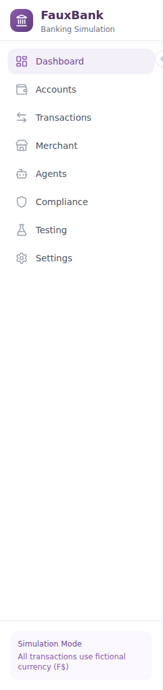

**Navigation Items:**
- **Dashboard** - System overview and key metrics
- **Accounts** - Manage customer accounts
- **Transactions** - View and manage transactions
- **Merchant** - Payment processing and authorizations
- **Agents** - Configure API access agents
- **Compliance** - KYC and dispute management
- **Testing** - Simulation controls and failure injection
- **Settings** - System configuration

**Features:**
- Collapsible sidebar (256px expanded, 64px collapsed)
- Active state highlighting with purple accent
- FauxBank branding with landmark icon
- Simulation mode indicator at bottom

### Collapsed Sidebar

The sidebar can be collapsed to provide more room for content while maintaining navigation functionality.

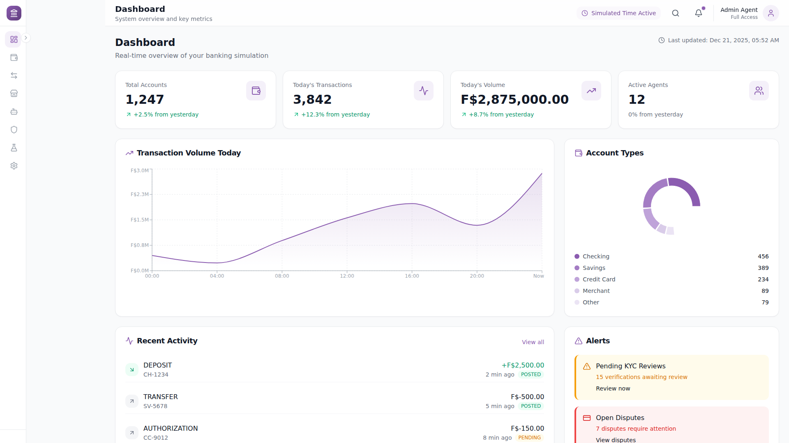

### Header

The header displays the current page title, subtitle, and provides quick access to search, notifications, and user menu.


---

## Dashboard

The Dashboard provides a real-time overview of the entire banking simulation with key metrics, charts, and alerts.

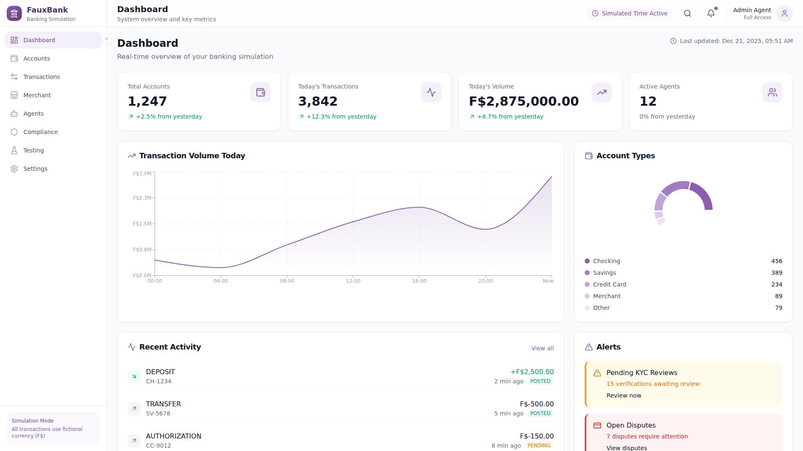

### Dashboard Features

#### Metric Cards

Four key performance indicators at the top:
- **Total Accounts** - Count with percentage change
- **Today's Transactions** - Daily transaction count
- **Today's Volume** - Transaction volume in F$ (FauxDollars)
- **Active Agents** - Number of connected API agents

#### Transaction Volume Chart

An area chart showing transaction volume trends throughout the day, rendered using Recharts with a purple gradient fill.

#### Account Types Distribution

A donut chart visualizing the distribution of account types:
- Checking
- Savings
- Credit Card
- Merchant
- Other

#### Recent Activity Feed

Real-time activity log showing:
- Deposits and withdrawals
- Transfers between accounts
- Card authorizations
- KYC submissions
- Status badges (Posted/Pending)

#### Alerts Panel

Notification cards highlighting items requiring attention:
- Pending KYC reviews (warning)
- Open disputes (error)
- Pending authorizations (info)

### Full Dashboard View

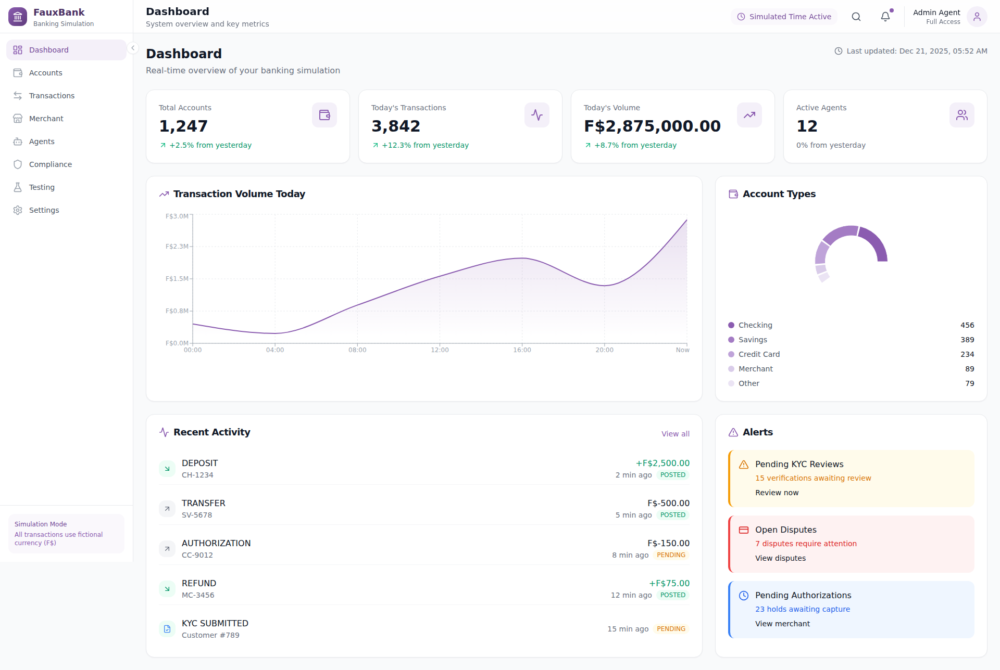

---

## Accounts Management

The Accounts page provides comprehensive account management capabilities including viewing, filtering, creating, and managing customer accounts.

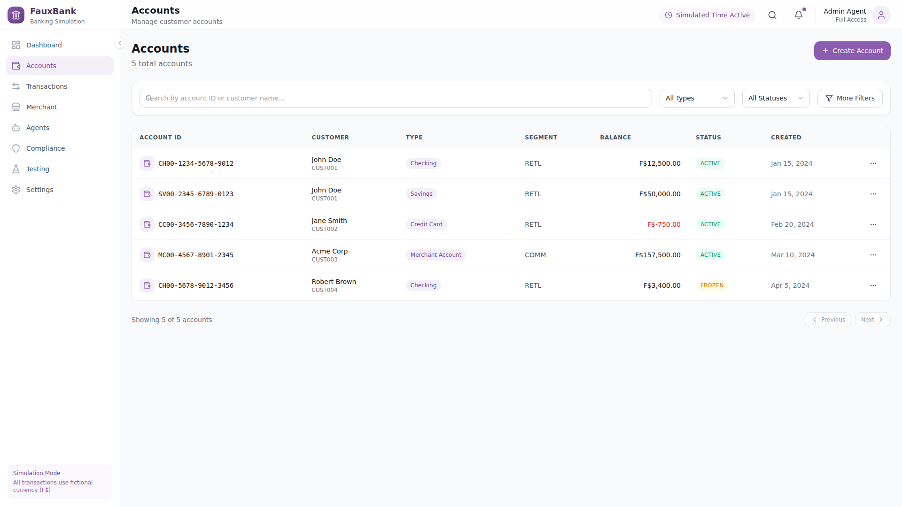

### Account List Features

#### Search and Filtering

- **Search bar** - Find accounts by ID or customer name
- **Type filter** - Filter by account type (Checking, Savings, Credit Card, etc.)
- **Status filter** - Filter by status (Active, Frozen, Closed, Pending)
- **Advanced filters** - Additional filtering options

#### Account Table

Displays accounts in a sortable table with columns:
- **Account ID** - Formatted account identifier with icon
- **Customer** - Customer name and ID
- **Type** - Account type badge
- **Segment** - Retail, Commercial, or Government
- **Balance** - Current balance with negative amounts in red
- **Status** - Status badge (Active/Frozen/Closed/Pending)
- **Created** - Account creation date
- **Actions** - Context menu

#### Pagination

Navigate through large account lists with previous/next buttons and item count display.

### Create Account Modal

Click "Create Account" to open the account creation form.

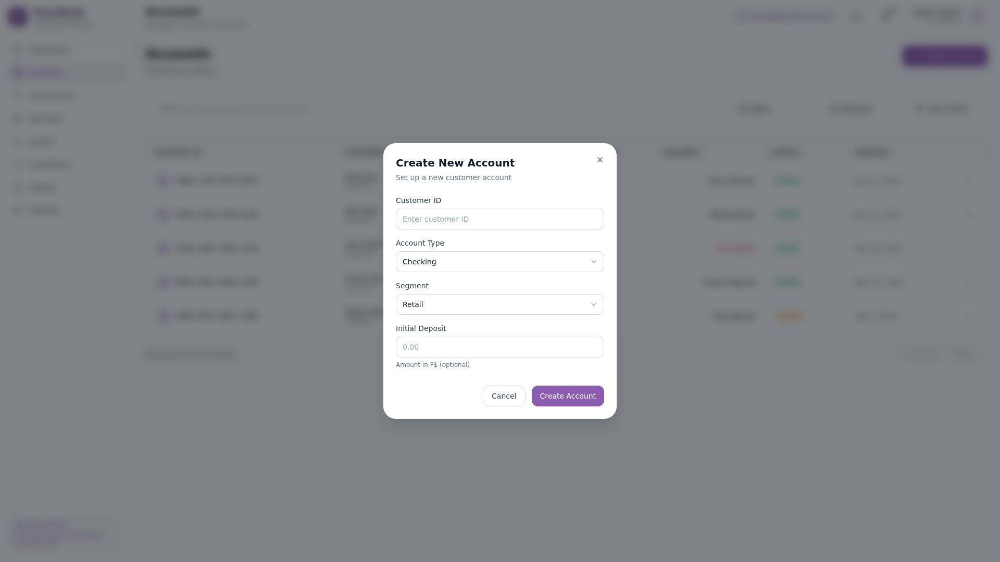

**Form Fields:**
- Customer ID (required)
- Account Type (dropdown)
- Segment (Retail/Commercial/Government)
- Initial Deposit (optional)

---

## Transactions

The Transactions page displays all banking transactions with filtering and search capabilities.

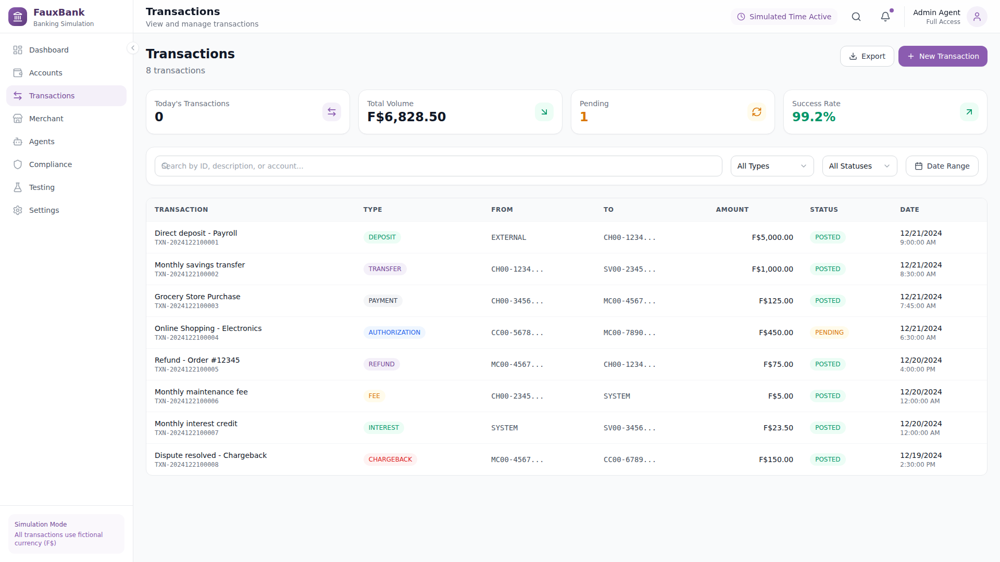

### Transaction Features

- **Transaction list** with type, amount, and status
- **Filtering** by date range, type, and status
- **Search** by transaction ID or reference
- **Export** capabilities for reporting
- **Real-time updates** as transactions process

---

## Merchant Operations

The Merchant page handles payment processing and card authorization management.

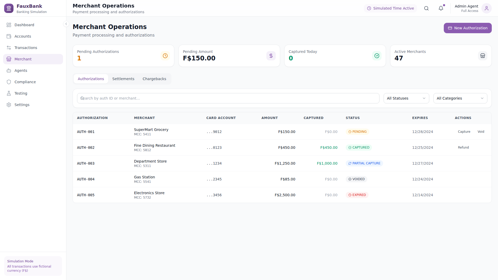

### Merchant Features

- **Payment processing** interface
- **Authorization management** - View and manage pending authorizations
- **Capture/Void** operations
- **Refund processing**
- **Transaction reporting**

### Full Merchant View

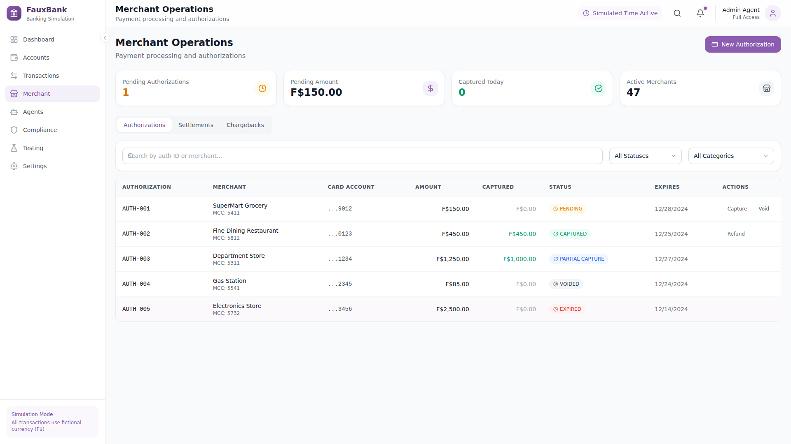

---

## Agent Management

The Agents page allows configuration of API access agents that interact with the banking simulation.

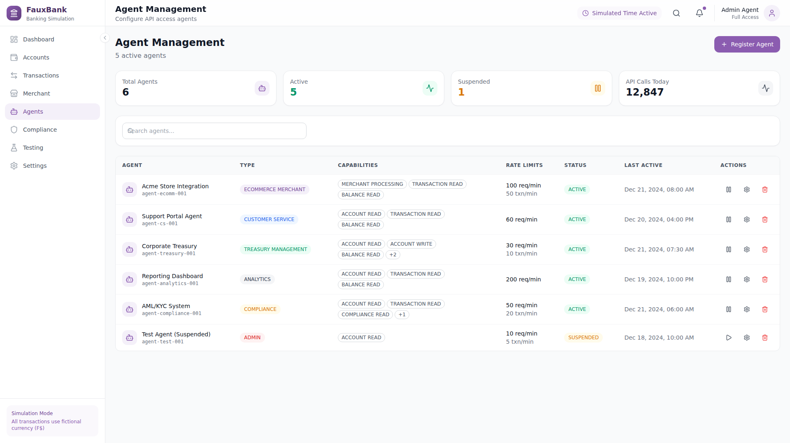

### Agent Features

- **Agent list** with connection status
- **Permission management** - Configure access rights
- **API key generation** and rotation
- **Activity monitoring** - Track agent operations
- **Rate limiting** configuration

### Full Agent View

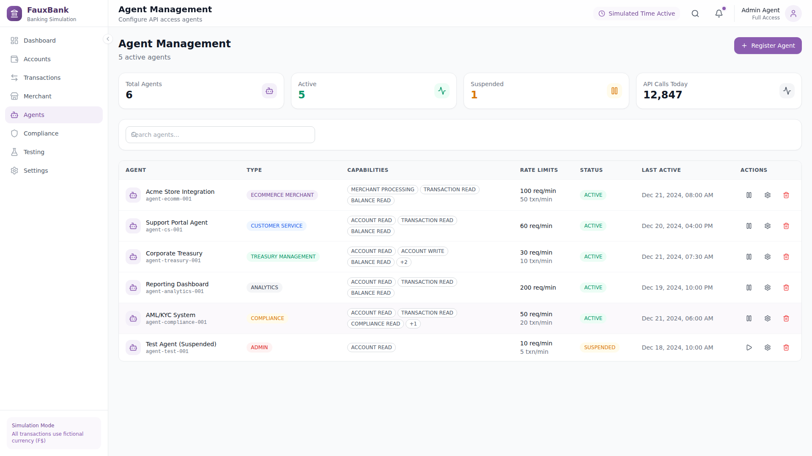

---

## Compliance Center

The Compliance page manages KYC verification and dispute resolution.

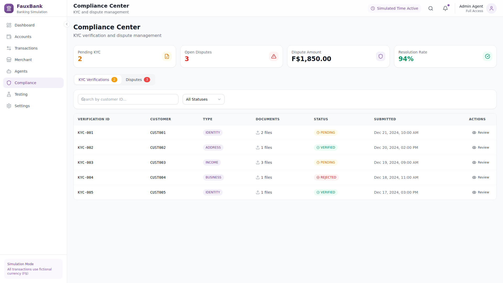

### Compliance Features

#### KYC Verification
- Document review workflow
- Verification status tracking
- Identity verification tools
- Risk assessment

#### Dispute Management
- Dispute tracking
- Resolution workflow
- Customer communication
- Documentation management

### Full Compliance View

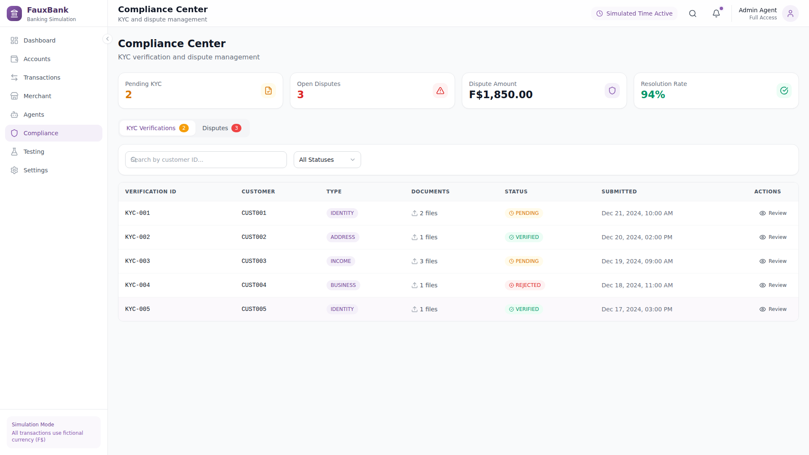

---

## Testing Tools

The Testing page provides simulation controls for testing various banking scenarios.

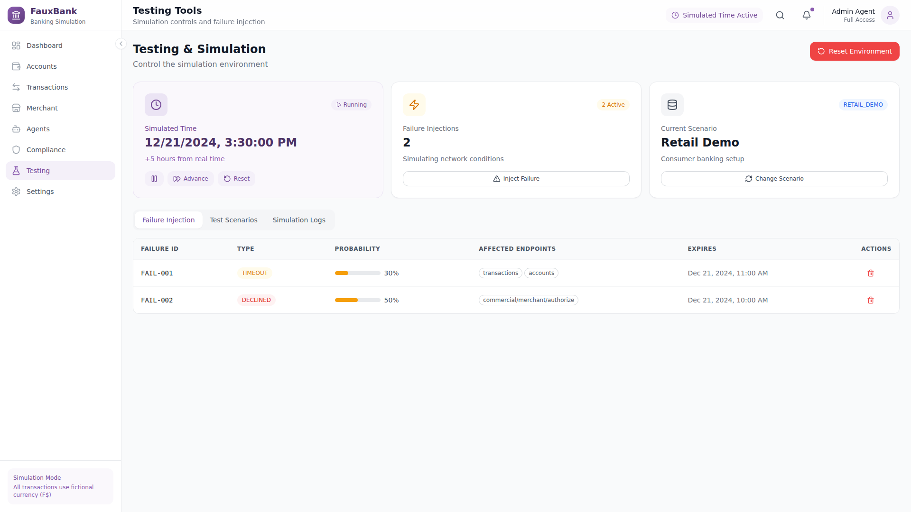

### Testing Features

- **Simulation controls** - Start/stop/reset simulations
- **Time advancement** - Fast-forward simulated time
- **Failure injection** - Test error handling scenarios
- **Scenario management** - Pre-configured test scenarios
- **Log viewer** - Real-time event logging

### Full Testing View


---

## Settings

The Settings page provides system configuration options.

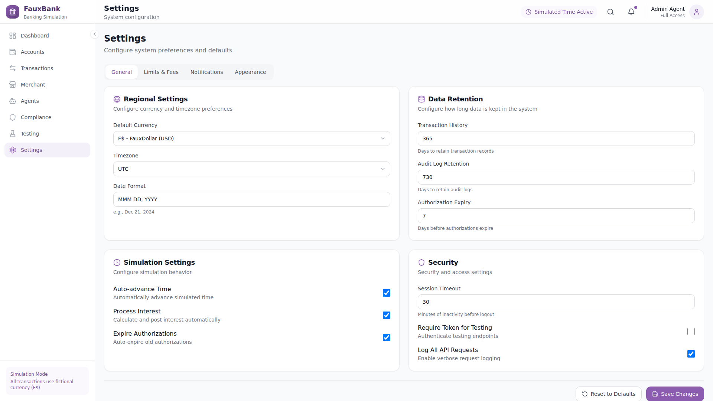

### Settings Categories

- **General** - Basic system settings
- **Notifications** - Alert preferences
- **Security** - Authentication settings
- **API** - API configuration
- **Appearance** - Theme and display options
- **Advanced** - Developer options

---

## Responsive Design

The FauxBank GUI is fully responsive, adapting to different screen sizes.

### Mobile Dashboard

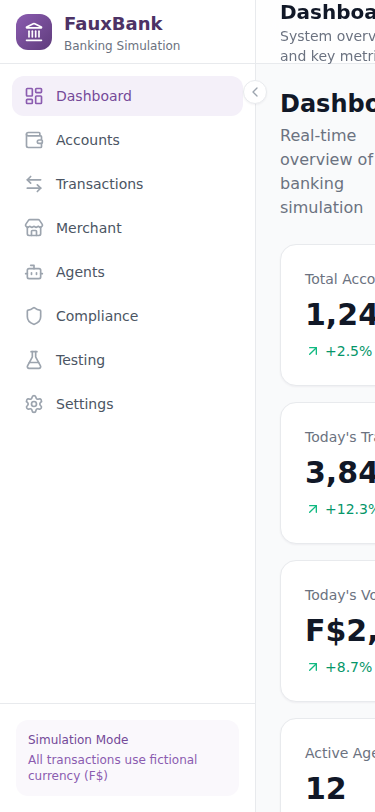

### Mobile Accounts

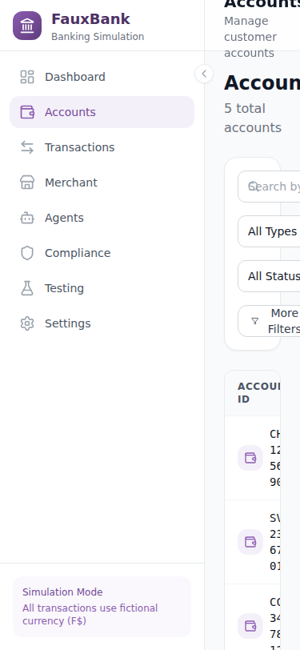

### Responsive Features

- **Collapsible sidebar** for mobile screens
- **Stacked layouts** for narrow viewports
- **Touch-friendly** buttons and controls
- **Adaptive charts** that resize gracefully

---

## Design System

### Color Palette

| Color | Usage | Hex |
|-------|-------|-----|
| **Purple 600** | Primary color, active states | `#8b5cb0` |
| **Purple 100** | Backgrounds, highlights | `#e8d9f3` |
| **Slate 900** | Primary text | `#0f172a` |
| **Slate 500** | Secondary text | `#64748b` |
| **Success 500** | Positive values, posted status | `#22c55e` |
| **Warning 500** | Pending status, alerts | `#f59e0b` |
| **Error 500** | Negative values, disputes | `#ef4444` |
| **Info 500** | Informational alerts | `#3b82f6` |

### Typography

- **Headings:** Inter font family, bold weight
- **Body:** Inter font family, regular/medium weight
- **Monospace:** JetBrains Mono for account IDs and amounts

### Components

The UI uses a consistent component library including:
- **Cards** - Content containers with subtle shadows
- **Buttons** - Primary, outline, ghost, and icon variants
- **Badges** - Status indicators with semantic colors
- **Tables** - Data display with sorting and selection
- **Modals** - Overlay dialogs for forms and confirmations
- **Inputs** - Text fields, selects, and form controls
- **Charts** - Area charts, pie charts, and bar graphs

### Animations

- **Fade-in** animations for page transitions
- **Hover effects** on interactive elements
- **Smooth transitions** for sidebar collapse
- **Loading spinners** for async operations

---

## Running the GUI

### Prerequisites
- Node.js 18+
- npm or yarn

### Development

```bash
cd frontend
npm install
npm run dev
```

The development server runs at `http://localhost:5173`

### Production Build

```bash
npm run build
npm run preview
```

---

## Summary

The FauxBank GUI provides a professional, modern interface for managing banking simulations. Key highlights include:

- Clean, purple-themed design inspired by modern fintech applications
- Comprehensive dashboard with real-time metrics and charts
- Full CRUD operations for accounts and transactions
- Testing tools for simulation control
- Responsive design for desktop and mobile use
- Consistent design system with reusable components

The interface is designed to be intuitive for banking professionals while providing the flexibility needed for testing and development scenarios.
